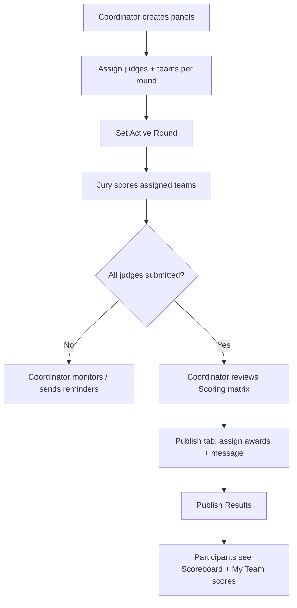

# Admin Flows & Capabilities

Complete reference for **Myntra Tech Week 2026 — HackerRamp Edition Six**. Documents every user type, what they can do, and step-by-step flows through the portal.

**Canonical app:** `v2.html` (single-file React SPA, in-memory state)  
**Related docs:** `Role_Explanation.md`, `User_Flow.md`, `System_Architecture.md`, `Design.md`

---

## Table of contents

1. [Role taxonomy](#1-role-taxonomy)
2. [Capabilities matrix](#2-capabilities-matrix)
3. [Access gates & navigation](#3-access-gates--navigation)
4. [Anonymous visitor](#4-anonymous-visitor)
5. [Participant](#5-participant)
6. [Team Lead (team admin)](#6-team-lead-team-admin)
7. [Mentor](#7-mentor)
8. [Jury / Judge](#8-jury--judge)
9. [Coordinator (platform admin)](#9-coordinator-platform-admin)
10. [Admin panel structure](#10-admin-panel-structure)
11. [Team management flows](#11-team-management-flows)
12. [Idea Bazaar flows](#12-idea-bazaar-flows)
13. [Judging & evaluation flows](#13-judging--evaluation-flows)
14. [Content CMS flows](#14-content-cms-flows)
15. [Management console flows](#15-management-console-flows)
16. [Notifications](#16-notifications)
17. [Data models](#17-data-models)
18. [Seed users (testing)](#18-seed-users-testing)
19. [Known gaps & implementation notes](#19-known-gaps--implementation-notes)

---

## 1. Role taxonomy

The portal uses **four platform roles** stored on `user.role`. Team leadership and competition personas are separate concepts.

### 1.1 Platform roles

| Role ID | Display label | Who they are |
|---------|---------------|--------------|
| `participant` | Participant | Myntra employee contestant — registers teams, submits ideas, competes |
| `coordinator` | Coordinator | Event organizer — full **Admin** panel (Systems Control) |
| `jury` | Jury · Business / Technical | Panel judge — **Jury Desk** (Overview + Judging only) |
| `mentor` | Mentor | Non-competing advisor — assigned to teams by coordinator |

**Jury sub-type:** `user.judgeType` = `business` | `technical` (shown in badge and used when building panels).

### 1.2 Team-level roles (not `user.role`)

| Role | Definition | How determined |
|------|------------|----------------|
| **Team Lead** | Creator and manager of a squad | `team.leadName === user.name` OR `team.members[0] === user.id` |
| **Team Member** | Joined participant | Listed in `team.members[]` |
| **Hackathon role** | Display label on registration | Team Lead, Frontend Dev, Backend Dev, ML Engineer, Designer, PM, etc. |

**Team Lead = “Team admin”** in product language. There is no separate `team_admin` platform role.

### 1.3 Persona tags (department-derived)

Personas affect badges and documented eligibility rules; they are **not** stored as `user.role`.

| Persona | Departments | Badge color | Documented rules |
|---------|-------------|-------------|------------------|
| **Hacker** | Engineering, Data Science, SRE, InfoSec, Analytics | Purple | At least one Hacker required for technical demo evaluation |
| **Hustler** | Product, Design, Marketing, Finance, Operations, etc. | Amber | At least one Hustler required for prototype verification |
| **Designer** | Design / UX (documented) | — | Best Design Award eligibility |

> **Note:** `getTag()` maps Design dept → Hustler today. Designer persona is documented in rules UI but not enforced in code.

### 1.4 Roles referenced but not implemented

| Name | Status |
|------|--------|
| `admin` | Checked in Fun Zone code only; no seed user has this role |
| **Organizer** | Copy synonym for Coordinator |
| **User** | Generic unsigned-in visitor |

---

## 2. Capabilities matrix

Legend: ✅ Yes · ❌ No · 👁 Browse only · 🔶 Partial

| Capability | Anonymous | Participant | Team Lead | Mentor | Jury | Coordinator |
|---|:---:|:---:|:---:|:---:|:---:|:---:|
| Browse Home, Agenda, Demo Booth, Scoreboard, FAQ, Contact | 👁 | ✅ | ✅ | ✅ | ✅ | ✅ |
| Browse Teams & Idea Bazaar | 👁 | ✅ | ✅ | ✅ | ✅ | ✅ |
| Sign in (SSO simulation) | — | ✅ | ✅ | ✅ | ✅ | ✅ |
| Register / create team | ❌ | ✅* | ✅* | ❌ | ❌ | ❌ |
| Join team (request) | ❌ | ✅ | ✅** | ❌ | ❌ | ❌ |
| Approve / decline join requests | ❌ | ❌ | ✅ | ❌ | ❌ | ✅ |
| Remove members / dissolve team | ❌ | ❌ | ✅ | ❌ | ❌ | ✅*** |
| Edit team profile | ❌ | ❌ | ✅ | ❌ | ❌ | ✅*** |
| Pick Idea Bazaar idea (team) | ❌ | ❌ | ✅ | ❌ | ❌ | ❌ |
| Submit Idea Bazaar idea | ❌ | ✅ | ✅ | ✅ | ✅ | ✅ |
| Upvote ideas | ❌ | ✅ | ✅ | ✅ | ✅ | ✅ |
| Moderate ideas (approve/reject) | ❌ | ❌ | ❌ | ❌ | ❌ | ✅ |
| Notifications (role-filtered) | ❌ | ✅ | ✅ | 🔶**** | ✅ | ✅ |
| Admin / Jury Desk nav item | ❌ | ❌ | ❌ | ❌ | ✅ | ✅ |
| Admin — Overview | ❌ | ❌ | ❌ | ❌ | ✅ | ✅ |
| Admin — Judging (score teams) | ❌ | ❌ | ❌ | ❌ | ✅***** | ✅ (monitor) |
| Admin — Content CMS | ❌ | ❌ | ❌ | ❌ | ❌ | ✅ |
| Admin — Management | ❌ | ❌ | ❌ | ❌ | ❌ | ✅ |
| Publish round results & awards | ❌ | ❌ | ❌ | ❌ | ❌ | ✅ |
| Assign mentor to team | ❌ | ❌ | ❌ | ❌ | ❌ | ✅ |
| Change user platform roles | ❌ | ❌ | ❌ | ❌ | ❌ | ✅ |
| Learn & Speakers — view | 👁 | ✅ | ✅ | ✅ | ✅ | ✅ |
| Learn & Speakers — CRUD sessions | ❌ | ❌ | ❌ | ❌ | ❌ | ✅ |
| Quizzes & memes (Fun Zone) | 🔶 | ✅ | ✅ | ✅ | ❌† | ✅† |

\* Cannot register if already on a team (enters edit/update mode instead)  
\** Can request to join other teams only if not already on one (enforced on accept)  
\*** Coordinator override via Admin → Management → Teams  
\**** Mentors receive participant-style notification bucket  
\***** Only assigned panels; only when view round = active round  
† Fun Zone component exists but is **not routed** in current `App()` — unreachable in v2

---

## 3. Access gates & navigation

### 3.1 Navigation visibility

| Nav item | Anonymous | Participant | Mentor | Jury | Coordinator |
|----------|-----------|-------------|--------|------|-------------|
| Home, Teams, Idea Bazaar, Agenda, etc. | ✅ | ✅ | ✅ | ✅ | ✅ |
| **Admin** / **Jury Desk** | ❌ | ❌ | ❌ | ✅ (label: Jury Desk) | ✅ (label: Admin) |
| Register | Footer / CTA only | ✅ | ✅ (blocked content) | ✅ (blocked) | ✅ (blocked) |

Register was removed from the header (`Design.md` §7) but remains reachable via Home CTA, footer, and deep links.

### 3.2 Page & modal gates

| View / action | Requirement | Gate message |
|---------------|-------------|--------------|
| `RegisterView` | Signed in | “Sign in with Google” |
| `RegisterView` — create team | `role !== mentor` and `role !== coordinator` | Role-specific blocked screen |
| `AdminView` | Signed in + `coordinator` or `jury` | “Access restricted” |
| Admin **Content** & **Management** | `coordinator` only | Tabs hidden for jury |
| `EnablementView` admin tools | `coordinator` only | Admin Tools toggle |
| `NotificationsView` | Signed in | Sign-in prompt |
| Join request modal | Signed in | Login modal |
| Idea submit modal | Signed in | Login modal |
| Score modal | Jury, active round, assigned panel | Disabled / hidden otherwise |

### 3.3 SSO (testing)

1. Click **Sign in**
2. Pick a seed user from the dropdown
3. Click **Sign in with Google**

Session is **not persisted** — page reload resets all state to seed constants.

There is **no impersonation mode**; picking another account at login is the only way to switch identity.

---

## 4. Anonymous visitor

### Capabilities
- Browse all public pages and lists
- View team cards, idea cards, scoreboard, agenda, speakers
- Cannot upvote, submit ideas, join teams, or open Admin

### Flow
```
Land on Home
  → Browse Teams / Idea Bazaar / Agenda / Scoreboard
  → Attempt authenticated action (upvote, join, register)
      → Login modal opens
  → Sign in → becomes signed-in user with that role
```

---

## 5. Participant

### Capabilities
- Create a team (if not already on one)
- Request to join open teams
- Submit and upvote Idea Bazaar ideas
- View own team dashboard (read-only if not Team Lead)
- Receive participant notifications

### Flow A — First-time team registration

```
Sign in as participant
  → Register (Home CTA / footer / #register)
  → Step 1: Team name, theme, sub-theme, abstract
            Optional: pick approved Idea Bazaar idea
            GenAI model preferences
  → Step 2: Open/Closed recruiting status
            Skills sought (required if Open)
            Roles sought (Hacker / Hustler / Designer chips)
  → Step 3: Review + agree to terms
  → Submit → team created with members:[user.id]
  → Success screen
```

**Validation (Step 1):** team name 3–40 chars, theme required, sub-theme required  
**Validation (Step 2):** if Open → at least one skill; if Closed → min 2 members (`TEAM_MIN_TO_CLOSE`)

### Flow B — Join an existing team

```
Teams tab
  → Filter/search open teams (capacity-based: members < maxSize)
  → Request to Join → modal with optional message
  → joinRequests entry created (status: pending)
  → Team Lead or Coordinator accepts
  → User added to team.members
```

### Flow C — Idea Bazaar (participant)

```
Idea Bazaar tab
  → Browse approved ideas
  → Upvote (toggle, tied to user ID)
  → Submit new idea → status: pending
  → Track in "Your submissions" (Pending / Approved / Rejected)
  → Edit submission while not approved
```

### Flow D — Evaluation visibility

```
My Team Dashboard (Teams tab, when on a team)
  → Round progress tied to pubResults publish state
Scoreboard tab
  → Public rankings when coordinator publishes results
```

---

## 6. Team Lead (team admin)

Team Lead is a **position on a team**, not a platform role. Any participant who created the team (or is `members[0]`) becomes Team Lead.

### Capabilities (in addition to participant)
- Approve / decline inbound join requests
- Remove members (not self if sole member)
- Dissolve team
- Toggle Open / Closed recruiting
- Edit team profile (re-enters Register wizard in edit mode)
- Pick Idea Bazaar idea (registration Step 1 only)

### Flow A — Manage inbound join requests

```
Teams tab → My Team Dashboard
  → "Join requests" section (or Notifications → actionable request)
  → Accept → user added to members, other pending requests for that user declined
  → Decline → request status updated
```

### Flow B — Edit team

```
My Team Dashboard → Edit Team Details
  → Register wizard (edit mode) pre-filled
  → Update name, theme, abstract, skills, idea pick, open/closed
  → Save → returns to Teams tab
```

### Flow C — Close recruiting

```
My Team Dashboard → toggle Open/Closed
  → Closed requires ≥ 2 members (TEAM_MIN_TO_CLOSE)
  → Open requires ≥ 1 skill in skillsNeeded
```

### Flow D — Dissolve team

```
My Team Dashboard → Dissolve Team → confirm
  → Team removed from teams[]
  → Related join requests cleared
```

### Team rules (documented in Teams RULE modal)

| Rule | Value |
|------|-------|
| Max team size | 5 (`TEAM_MAX_SIZE`) |
| Min to close | 2 members |
| Card badge | **Open** if `members.length < maxSize`; **Full** at capacity |
| Cross-functional | Hacker + Hustler encouraged (not code-enforced) |

---

## 7. Mentor

### Capabilities
- Browse portal (Teams, Idea Bazaar, Home, etc.)
- Submit ideas and upvote (same as participant)
- **Cannot** register or join a competitive team
- **No dedicated mentor dashboard** in v2

### Flow

```
Sign in as mentor (e.g. Vikram Mehta, U005)
  → Register page shows "You're registered as a Mentor"
  → Browse Teams / Idea Bazaar
  → Wait for coordinator to assign via Admin → Teams → Mentor dropdown
```

**Gap:** Mentor cannot see assigned teams in-app after assignment (field `team.mentor` exists but no mentor-facing UI).

---

## 8. Jury / Judge

Jury members see **Jury Desk** (Admin panel with restricted sections).

### Capabilities
- Overview: panel assignments, round state, submission progress
- Judging: score assigned teams in **active round only**
- Cannot access Content or Management tabs
- Cannot create teams or moderate ideas

### Flow A — Daily judging workflow

```
Sign in as jury (e.g. Kavita Iyer, U_J1)
  → Nav: Jury Desk
  → Overview: see assigned panels per round (R1/R2/R3)
      → Round states: Locked | Scoring open | Complete
  → Judging tab → Scoring
  → Select view round (must match active round to score)
  → For each assigned team → Score
  → Scoring modal: rate 6 criteria (1–5 each, total /30)
      → Save Draft (isDraft: true)
      → Submit Score (final)
  → Repeat until all assigned teams submitted
```

### Scoring criteria (6 × 1–5 = /30)

| Key | Label |
|-----|-------|
| `prob` | Problem & Idea |
| `prod` | Production Path |
| `cust` | Customer Impact |
| `bus` | Business Impact |
| `strat` | Strategy / Moat |
| `pitch` | Pitch & Defense |

### Round gating

| Round vs active | State | Jury can score? |
|-----------------|-------|-----------------|
| Past round | Complete | View only |
| Current (`activeRound`) | Active | ✅ Yes |
| Future round | Locked | ❌ No |

---

## 9. Coordinator (platform admin)

Coordinator is the **full platform administrator**. Nav label: **Admin**.

### Capabilities summary
- Everything jury can see (monitoring), plus:
- Full **Content** CMS (homepage, schedule, winners, stats)
- Full **Management** console (teams, users, ideas, problems, join requests)
- Panel creation, judge assignment, active round control
- Publish / unpublish round results and per-team awards
- Promote users to jury / mentor / coordinator
- Assign mentors to teams
- Override team membership and join requests

### Flow A — Event setup (pre-competition)

```
Sign in as coordinator (Rohit Kumar, U003)
  → Admin → Overview (health check)
  → Management → Idea Approvals
      → Review pending ideas → Approve / Reject (with comment)
      → Edit qualification instructions & themes
  → Management → Problems
      → CRUD problem statements for Bazaar header
  → Content → Schedule / Calendar / Hero / Stats
      → Configure public-facing copy and timeline
  → Judging → Panels
      → Create panels per round
      → Assign judges (business + technical mix) + teams
      → Set cutoff datetime (optional)
```

### Flow B — Registration period

```
Admin → Overview
  → Monitor: open teams, pending join requests, pending ideas
  → Management → Join Requests → Accept / Decline globally
  → Management → Teams
      → Edit rosters, assign mentors, add/remove members
      → Handle inline join requests on team cards
  → Management → Users
      → Promote participants to jury (set judgeType)
      → Assign mentors
```

### Flow C — Active round operations

```
Admin → Judging
  → Set Active Round (R1 / R2 / R3)
  → Panels tab: verify assignments complete
  → Scoring tab: monitor judge × team matrix
  → Overview: "Needs attention" — overdue scores, incomplete panels
  → Notifications: jury reminders fire (seed data)
```

### Flow D — Publish results

```
Admin → Judging → Publish tab
  → Select round (R1 / R2 / R3)
  → Assign per-team awards (Top 20, Finalist, Winner, Best UI/UX, etc.)
  → Write announcement message
  → Publish Results → visible on Scoreboard + team dashboards
  → Unpublish to retract (toggle)
```

### Flow E — Content live edits

```
Admin → Content
  → Hero (layout A/B)
  → Home stats strip
  → Winners board (drag reorder, add/edit)
  → Idea spotlight order
  → Event schedule & 31-day calendar
  → Rewards / prizes copy
```

---

## 10. Admin panel structure

### Coordinator sections

```
Admin (Systems Control)
├── Overview      — stats, lifecycle, standings, attention items, shortcuts
├── Judging
│   ├── Panels    — CRUD panels, assign judges + teams, active round picker
│   ├── Scoring   — judge × team score matrix, panel averages
│   └── Publish   — awards, message, publish/unpublish per round
├── Content
│   ├── Hero, Stats, Winners, Ideas spotlight
│   ├── Schedule, Rewards, Calendar
│   └── Collapsible section editors
└── Management
    ├── Teams         — search, edit, mentor assign, membership, join requests
    ├── Users         — role promotion, jury type, team assignment
    ├── Join Requests — global queue
    ├── Idea Approvals— moderate + themes + qual instructions
    ├── Problems      — Bazaar problem statements
    └── Team Progress — setup checklist (simulated: git, sandbox, api, infosec)
```

### Jury Desk sections

```
Jury Desk
├── Overview  — assigned panels, round state, submission counts
└── Judging
    ├── Scoring — score assigned teams (active round only)
    └── (Panels / Publish hidden)
```

---

## 11. Team management flows

| Flow | Initiator | Steps | Outcome |
|------|-----------|-------|---------|
| **Create team** | Participant | Register 3-step wizard | New team, user = lead + sole member |
| **Update profile** | Team Lead | Edit Team Details → Register edit | Team fields updated; idea pick synced |
| **Request join** | Participant | Teams → Request to Join | `joinRequests` pending entry |
| **Accept join (lead)** | Team Lead | Dashboard or Notification | Member added; competing requests declined |
| **Accept join (admin)** | Coordinator | Admin → Teams or Join Requests | Same + capacity check |
| **Decline join** | Team Lead / Coordinator | Decline button | Request status → declined |
| **Remove member** | Team Lead / Coordinator | Confirm dialog | User removed from `members[]` |
| **Add member (admin)** | Coordinator | Admin → Teams → Add member | Direct add; move confirm if user on another team |
| **Assign mentor** | Coordinator | Team card mentor `<select>` | `team.mentor = userId` |
| **Dissolve team** | Team Lead | Confirm | Team deleted |
| **Delete team (admin)** | Coordinator | Admin → Teams → Delete | Team removed |
| **Pick idea** | Team Lead | Register Step 1 dropdown | `team.pickedIdeaId` + `idea.pickedBy` synced |
| **Change user role** | Coordinator | Admin → Users → role select | `user.role` updated |
| **Assign user to team** | Coordinator | Admin → Users → team select | User added to team |

### Capacity & status logic

```
isOpen(team)     = members.length < maxSize     → card shows Open / Full
team.open        = recruiting flag (Open/Closed) → separate from capacity badge
TEAM_MAX_SIZE    = 5
TEAM_MIN_TO_CLOSE = 2
```

---

## 12. Idea Bazaar flows

| Action | Actor | Result |
|--------|-------|--------|
| Browse approved ideas | Anyone | Filter, search, paginate |
| Upvote | Signed-in user | Toggle in `idea.upvotes[]` |
| Submit idea | Signed-in user | `status: 'pending'` |
| Approve | Coordinator | Idea goes public; author notified |
| Reject | Coordinator | `rejectionComment` stored; author notified |
| Revoke approved | Coordinator | Removed from public list |
| Pick for team | Team Lead (Register only) | `team.pickedIdeaId`; idea shows "Picked · {team}" |
| Edit qual instructions | Coordinator | Sidebar copy on Bazaar |
| Manage themes | Coordinator | Theme list for submissions |
| Problem statements | Coordinator | `INIT_PROBLEMS`; published count on header |

**Removed (per Design.md):** "Pick for my team" on Bazaar cards — picking is registration-only.

---

## 13. Judging & evaluation flows

### Data structures

**Panel**
```javascript
{ id, name, round: 'R1'|'R2'|'R3', teamIds: [], judgeIds: [], cutoffAt }
```

**Judge score**
```javascript
{ id, panelId, teamId, judgeId, round, criteria: { prob, prod, cust, bus, strat, pitch }, total, isDraft, submittedAt }
```

**Published results**
```javascript
pubResults: {
  R1: { published: bool, message: string, teams: [{ id, name, award }] },
  R2: { ... },
  R3: { ... }
}
```

### End-to-end evaluation flow



### Award options (coordinator)

`Top 20` · `Top 5 Finalist` · `Winner 🏆` · `Runner Up 🥈` · `Best UI/UX 🎨` · `Most Innovative 💡` · `Audience Choice ❤️`

### CSV export

Coordinator can download `techweek_scores.csv` from Admin (team × R1/R2/R3 × average).

---

## 14. Content CMS flows

Coordinator-only. All edits update in-memory state immediately (live preview on Home / Agenda).

| Content area | Actions |
|--------------|---------|
| **Hero** | Toggle layout A vs B |
| **Home stats** | Edit metric values and labels |
| **Winners board** | Add, edit, delete, drag-reorder winner cards |
| **Idea spotlight** | Drag-reorder featured ideas on home |
| **Event schedule** | Edit phase labels, dates, status (live/completed/upcoming) |
| **Rewards** | Edit prize copy and tiers |
| **31-day calendar** | Edit hackathon calendar entries |

**Learn & Speakers** (separate view): Coordinator toggles **Admin Tools** → add/edit/delete enablement sessions.

---

## 15. Management console flows

### Teams tab
- Search by name/theme; filter by theme, mentor
- Paginated team cards (12 per page)
- Per team: Edit, Delete, Assign mentor, Add member, Remove member
- Inline pending join requests with Accept/Decline
- Edit modal: name, theme, sub-theme, abstract, open flag, max size

### Users tab
- Search; filter by dept and role
- Change role: `participant` → `mentor` → `jury` → `coordinator`
- Jury: set `judgeType` (business / technical)
- Assign participant to team (dropdown)

### Join Requests tab
- Filter: pending / accepted / declined
- Search by user or team name
- Bulk Accept / Decline with capacity checks

### Idea Approvals tab
- Filter: pending / approved / rejected
- Approve, Reject (with comment), Revoke, Restore
- Edit idea inline
- Manage themes list
- Edit qualification instructions

### Problems tab
- CRUD problem statements (title, category, difficulty, description, published flag)
- Filter by category and published state

### Team Progress tab
- Simulated setup checklist per team: Git repo, Sandbox, API access, InfoSec clearance
- Used for coordinator visibility during build phase

---

## 16. Notifications

### Audience buckets

| `audience` | Who sees it |
|------------|-------------|
| `participant` | Participants (and mentors mapped to this bucket) |
| `coordinator` | Coordinators only |
| `jury` | Jury only |
| `all` | Everyone signed in |

### Notification kinds

`invite` · `accept` · `request` · `idea` · `upvote` · `approved` · `rejected` · `progress` · `scores` · `deadline` · `winners` · `team` · `pending` · `panel` · `round` · `submit`

### Actionable notifications

Join requests (`actionable: true`) render inline **Accept / Decline** in the notifications drawer and deep-link to `teams` or `admin`.

---

## 17. Data models

### User
```javascript
{
  id: 'U001',
  name: 'Arjun Sharma',
  email: 'arjun.sharma@myntra.com',
  dept: 'Engineering',
  role: 'participant' | 'coordinator' | 'mentor' | 'jury',
  judgeType?: 'business' | 'technical'  // jury only
}
```

### Team
```javascript
{
  id: 'T001',
  name, theme, subTheme, abstract,
  members: ['U001', 'U002'],
  depts: ['Engineering', 'Design'],
  maxSize: 5,
  open: boolean,
  skillsNeeded: [],
  rolesNeeded: ['Hacker'],
  leadName, leadDept,
  pickedIdeaId: string | null,
  mentor: string | null,        // user id
  genaiModel, otherAccess,
  scores: { r1, r2, r3 }
}
```

### Idea
```javascript
{
  id, title, problemStatement, impact, desc, theme,
  authorId, authorName, authorDept,
  status: 'pending' | 'approved' | 'rejected',
  submittedAt,
  upvotes: [userId],
  rejectionComment,
  pickedBy: teamId | null
}
```

### Join request
```javascript
{
  id, teamId, teamName,
  userId, userName, userDept,
  message,
  status: 'pending' | 'accepted' | 'declined' | 'removed',
  direction: 'join',
  createdAt, resolvedAt?
}
```

---

## 18. Seed users (testing)

| ID | Name | Role | Notes |
|----|------|------|-------|
| U001 | Arjun Sharma | participant | Engineering |
| U002 | Priya Patel | participant | Design |
| U003 | Rohit Kumar | **coordinator** | Full Admin |
| U004 | Neha Singh | participant | Data Science |
| U005 | Vikram Mehta | **mentor** | Cannot register team |
| U006 | Sneha Reddy | participant | SRE |
| U007 | Aditya Bose | participant | InfoSec |
| U008 | Kabir Mehta | participant | Engineering |
| U_J1 | Kavita Iyer | **jury** | business |
| U_J2 | Sameer Bhat | **jury** | business |
| U_J3 | Deepak Rao | **jury** | technical |
| U_J4 | Ananya Krishnan | **jury** | technical |

**Quick test paths:**
- Coordinator: sign in as Rohit Kumar → Admin
- Jury: sign in as Kavita Iyer → Jury Desk
- Team Lead: sign in as Arjun Sharma → Teams → My Team Dashboard
- Mentor blocked: sign in as Vikram Mehta → Register

---

## 19. Known gaps & implementation notes

| Gap | Detail |
|-----|--------|
| **No backend** | All state in-memory; refresh resets to seed data |
| **`admin` role** | Referenced in Fun Zone; no user assigned |
| **Fun Zone unrouted** | `RichFunZoneView` not in `App()` view switch |
| **Mentor portal** | No UI for mentors to see assigned teams |
| **Designer persona** | Documented but `getTag()` maps Design → Hustler |
| **Team composition validation** | Hacker/Hustler rules in FAQ only — not enforced on submit |
| **Coordinator as scorer** | Older docs say coordinator scores; v2 uses jury panels + coordinator publish |
| **Signup wizard** | `User_Flow.md` / `v3.html` have multi-step signup; v2 is SSO picker only |
| **Weighted R1/R2/R3 criteria** | `System_Architecture.md` describes weighted breakdown; UI uses flat 6-criterion /30 |
| **Multi-team membership** | Not blocked at request time; blocked on admin accept if already on team |
| **index.html** | Redirects to v2; `System_Architecture.md` still references index as primary |

---

## Quick reference — who goes where

```
Anonymous     → Browse only
Participant   → Compete, join/create teams, Idea Bazaar
Team Lead     → + Manage squad, approve joins, pick ideas
Mentor        → Advise (assigned by coordinator), no competing
Jury          → Jury Desk → score assigned teams
Coordinator   → Admin → full platform control
```

---

*Last updated to match `v2.html` implementation. For design tokens and UI patterns see `Design.md`.*
