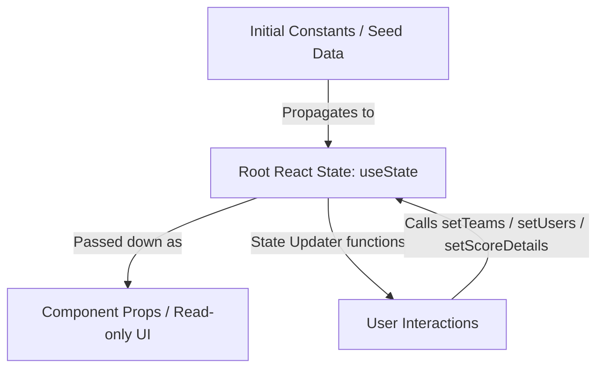

# System Architecture & AI Developer Guide

This document explains the technical architecture, runtime model, file layout, and state management of the **Myntra Tech Week 2026** codebase to help developers and AI agents understand and modify the application safely.

---

## 1. Runtime Model & Tech Stack

This application is built as a **Single-Page Application (SPA) contained within a single HTML file**. It bypasses modern server-side compilation tools in favor of browser-level execution:

*   **Runtime Transpilation**: JSX is parsed on-the-fly in the browser using the **Babel Standalone CDN** (`@babel/standalone`).
*   **Core UI Library**: **React 18** (loaded via unpkg CDN). No build step (`npm run build`) is required for standard deployment.
*   **Styling Engine**: A hybrid of **Tailwind CSS CDN v3** (for layout classes) and **Custom CSS variables** (defined in a `<style>` block in `<head>` for specific color tokens, font overrides, animations, and scrollbar details).
*   **External Assets**: Three.js (used for visual dotted grids) and assets sourced from picsum/myntra servers.

---

## 2. Workspace File Layout

```
├── index.html                  # Main React SPA web app (322KB)
├── hackerramp_final Updated Design.html  # Alternative redesigned template (142KB)
├── Design.md                       # Design tokens, typography & style guide
├── User_Flow.md                    # Interaction flows & screen mappings
├── Role_Explanation.md             # Permissions & user persona matrices
├── System_Architecture.md          # This file (AI developer documentation)
├── add_scoring.js                  # Scoring helpers
├── replacer.js                     # Content replacement utility
└── update_*.py                     # Programmatic update scripts (Python)
```

> [!IMPORTANT]
> **Active Target File**: `index.html` is the primary executable web application. All program scripts (like `update_roles.py`, `update_scoring.py`, etc.) target this file directly. 
> `hackerramp_final Updated Design.html` is an alternative mockup template that holds a separate visual design and should not receive backend or functional code edits unless requested.

### Programmatic Python Updates (`update_*.py`)
Because the main HTML files are large (up to 320KB, containing 4900+ lines), replacing the entire file directly via LLMs can lead to context constraints, latency, or formatting truncation. 
Previous iterations use small, isolated python scripts to execute search-and-replace updates on `index.html`.

*   **Example (`update_search.py`)**: Loads the file, searches for target raw HTML strings, replaces them with new React components, and saves the file back.
*   **Recommendation for other AI Tools**: If you need to make extensive changes, write a similar Python script to perform target replacements rather than trying to output the entire 4900-line index file at once.

---

## 3. Data Flow & Local State Management

The application operates with **no persistent backend server**. All data creation, updates, and evaluations occur in **in-memory React state** at the root component level:



### Core In-Memory State Vectors:
1.  `user`: The currently logged-in user object (`null` if anonymous). Controls access to coordinator tabs and team editing privileges.
2.  `teams`: Loaded from `INIT_TEAMS` constant. Stores team membership, tags, descriptions, department affiliations, and round scores.
3.  `scoreDetails`: Tracks granular scoring cards (1 to 5 criteria ratings) and includes boolean flags such as `isDraft` to determine draft statuses.
4.  `ideas`: Tracks marketplace submissions (e.g. *Smart Size Recommender*, *Myntra MCP Server*) and handles upvote tracking mapped to user IDs.

*   *Warning for developers*: Any page refresh clears the in-memory state and reloads the default constants defined at the top of the script tag.

---

## 4. Key Scoring Algorithms & Calculations

Scores are divided into three rounds: **Round 1 (Ideation)**, **Round 2 (Prototype)**, and **Round 3 (Finale)**. 

### Weighted Criteria Calculations:
Scores are calculated out of 100 points, derived from weighted criteria matching the phase configuration:
*   **R1 Weight Breakdown**: Problem Understanding (25%), Solution Novelty (30%), Feasibility (25%), Team Composition (20%).
*   **R2 Weight Breakdown**: Technical Execution (35%), Demo Quality (25%), Innovation Index (20%), Business Impact (20%).
*   **R3 Weight Breakdown**: Product Completeness (30%), Scalability Plan (25%), Jury Q&A (25%), Presentation (20%).

*   **Jury Rating Matrix**: Coordinators evaluate each criterion on a `1 to 5` scale. The cumulative score is computed:
    $$\text{Total Score} = \sum (\text{Jury Score} \times \text{Weight})$$
    and mapped into the active team metrics vector.

---

## 5. Local Development & Previewing

Since the application uses CDN imports for React, Babel, and Tailwind, it runs entirely client-side without any compilation steps:

*   **Direct Browser Access**: You can open `index.html` directly in any web browser (`file:///` protocol) to preview it.
*   **Local HTTP Server**: For features relying on cookie paths or relative asset structures, spin up a local server:
    *   **Python**: `python -m http.server 8000`
    *   **Node.js**: `npx serve` or `npm install -g serve && serve`
*   **Previewing Flowcharts**: Open `user_flows_map.html` directly in a browser to review the visual node mapping.
