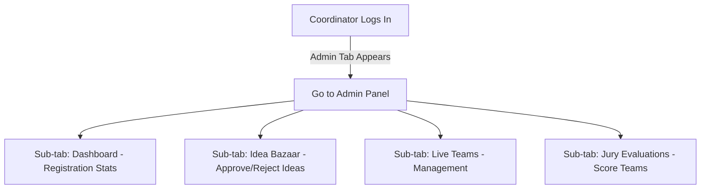

# User Flow & Navigation Map

This document outlines the workflows, state changes, and navigation journeys of users within the **Myntra Tech Week 2026** portal.

---

## 1. Authentication & Onboarding Flow

```mermaid
graph TD
    A[Visitor Enters Portal] --> B{Click "Sign In" or "Register"}
    B --> C[Sign In Modal Opens]
    C --> D[Select Simulation User / SSO]
    C --> E[Choose "Create Account" Tab]
    E --> F[Select User Role: Participant vs. Coordinator]
    F --> G[Complete Step-by-Step Registration Form]
    G --> H[User Logged In & Session Initialized]
```

### Steps:
1.  **Entry Point**: A user can click **Sign In** in the header or attempt an authenticated action (like *Create Team* or *Upvote Idea*), which triggers the Account Modal.
2.  **SSO Quick Sign-in**: The modal provides a list of pre-configured simulation users (e.g., Arjun Sharma, Priya Patel, Rohit Kumar) representing different roles. Selecting a user signs them in instantly.
3.  **Sign Up Wizard**:
    *   **Step 1**: Basic info (Name, Myntra email verification, Department).
    *   **Step 2**: Role group designation:
        *   **Participant**: Prompts selection of persona (`Hacker` or `Hustler` or `Designer`).
        *   **Coordinator / Mentor**: Requires supplementary details (years of experience, motivation).
    *   **Completion**: Confirms registration, stores user in transient memory, and activates state alerts.

---

## 2. Participant Journey (Hacker / Hustler / Designer)

### A. Team Creation and Management (The "My Team" Switch)
```mermaid
graph LR
    A[Unregistered Participant] -->|Clicks "Register" Tab| B[Create / Join Team Form]
    B -->|Submit Team Details| C[Team Created]
    C -->|Re-enters "Register" Tab| D[Dynamic "My Team" Dashboard]
    D -->|Edit Profile| E[Update Team Pitch / Partner Details]
    D -->|Track Evaluation| F[View Live Jury Scores & Status]
```
*   **The Register Tab State**: Before forming a team, the "Register" navigation tab leads to a creation wizard.
*   **Team Creation**: The participant provides a Team Name, Theme selection, Project Abstract, Department, and searches for partners.
*   **Transformation**: Upon submission, the "Register" navigation link is dynamically renamed to **My Team**. Clicking this tab now reveals a team management page with editing options, checklist indicators, and real-time score indicators.

### B. Finding a Partner (Teams Directory)
*   Participants browse the **Teams** tab.
*   They filter by specific looking-for tags (e.g. *Seeking: Designer* or *Seeking: Hustler*) and Skills (e.g. *React*, *Machine Learning*).
*   If a team is labeled `Open` with available spots, the user can click **Request to Join** which sends a notification or joins directly if credentials match department restrictions (cross-department teams are incentivized).

### C. Idea Bazaar Interaction
*   Users browse the **Idea Bazaar** to search for ideas proposed by customer support, category managers, or logistics operators.
*   Users can **Upvote** ideas (toggles upvote count, tied to User ID) or **Claim** an idea to immediately pre-fill it into their *Create Team* form.
*   Users can submit new ideas to the bazaar, which queue under a `Pending` state for coordinator review.

### D. The Fun Zone
*   Participants take timed **Quizzes** (Trivia, tech stacks, or spotting fake reviews) to score points.
*   Participants browse and upload event-themed **Memes** or upvote existing memes to increase team engagement metrics.

---

## 3. Coordinator / Admin Journey

Only users with the role `coordinator` (e.g., Rohit Kumar `U003`) can access the **Admin** dashboard.



### Key Flows:
1.  **Idea Moderation**: Coordinator reviews user-submitted ideas. Approving them posts them to the public Idea Bazaar.
2.  **Team Tracking**: Coordinator manages all registered teams, resolves validation warnings (e.g., a team lacking a Hustler), or disqualifies entries.
3.  **Jury Scoring**:
    *   Coordinator selects a target round evaluation: **Round 1 (Ideation)**, **Round 2 (Prototype)**, or **Round 3 (Finale)**.
    *   Clicking **Score** on a team row launches the **Detailed Scoring Modal**.
    *   Coordinator rates the team from 1 to 5 stars across the five scoring metrics.
    *   **Save Draft**: Saves the scores in-memory. The score button turns amber and appends a `(Draft)` warning tag.
    *   **Submit Score**: Validates the score as final. The button turns green and displays a checkmark `✓`.
4.  **Publish Awards**: Coordinator can toggle the publication state of final rankings and award categories (e.g., Winner, Runner-Up, Best Design).
